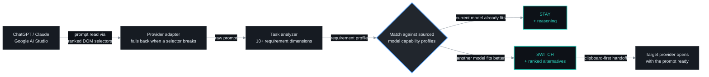
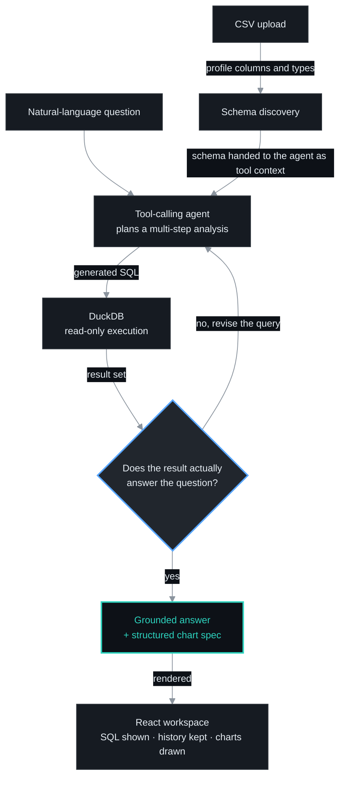
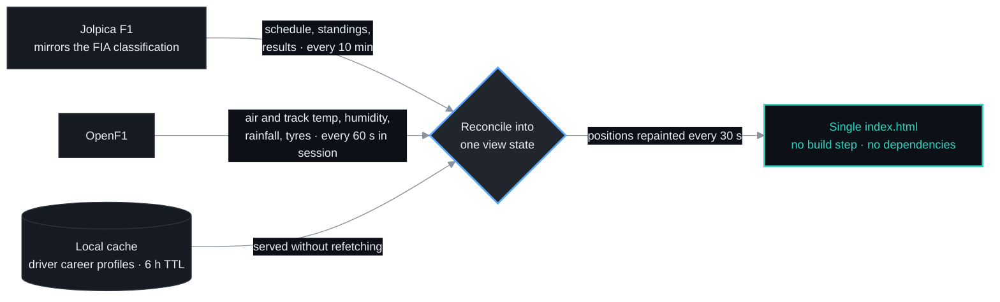
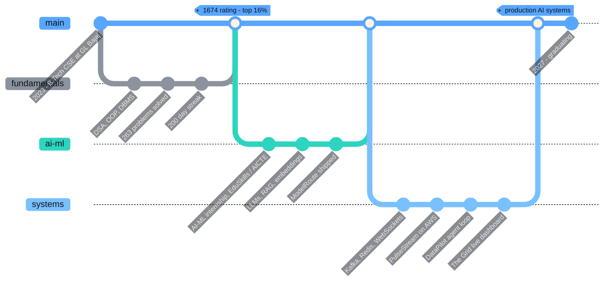

<div align="center">

<a href="https://aman-singh-yadav-portfolio.vercel.app/">

</a>


<br />

<a href="https://aman-singh-yadav-portfolio.vercel.app/"></a>
<a href="https://www.linkedin.com/in/amansinghyadav9569/"></a>
<a href="mailto:aman.dev9569@gmail.com"></a>
<a href="https://www.instagram.com/aman.singh.yadav_"></a>

<br />


</div>

## ABOUT

<div align="center">

</div>

I build systems where the model is a **component**, not the product. Most of my work sits in the
unglamorous half of AI engineering: making retrieval stay grounded, making an agent's output get
checked before anyone reads it, and making a pipeline behave when the same event shows up twice.

Currently in my final years of CSE (AI &amp; ML) at GL Bajaj, shipping LLM agents, real-time event
infrastructure, and the monitoring that keeps both honest.

<div align="center">


<br />


<br /><br />
<a href="https://drive.google.com/file/d/1ngmgoW5seeT9NDH7_udMvVVVrvnoR3HP/view?usp=sharing"></a>
<a href="https://drive.google.com/file/d/1ZZ6WqIOIph5qAVpGRFCUTFV7p_OYGjch/view?usp=sharing"></a>

<br /><br />

<table>
<tr>
<td width="50%" valign="top">
<br />
<b>INTELLIGENT SYSTEMS</b><br />
<sub><i>Retrieval that stays grounded, and agents whose output is validated before you see it.</i></sub><br />
<sub>LLM orchestration · RAG over pgvector · embeddings · semantic search · tool calling · prompt engineering · scikit-learn</sub>
</td>
<td width="50%" valign="top">
<br />
<b>REAL-TIME &amp; DISTRIBUTED</b><br />
<sub><i>Pipelines that stay correct when the same message arrives twice.</i></sub><br />
<sub>Kafka topics and consumer groups · idempotent workers · WebSocket fan-out · throughput, lag and latency tracking</sub>
</td>
</tr>
<tr>
<td width="50%" valign="top">
<br />
<b>BACKEND ENGINEERING</b><br />
<sub><i>Tenant boundaries enforced at the edge, never assumed downstream.</i></sub><br />
<sub>FastAPI and Express services · REST design · multi-tenant isolation · API-key auth · OAuth 2.0 · schema and query design</sub>
</td>
<td width="50%" valign="top">
<br />
<b>SHIP &amp; OPERATE</b><br />
<sub><i>Services that report their own latency, lag and failures.</i></sub><br />
<sub>Dockerised services on AWS · Linux · CI/CD pipelines · automated test suites · debugging real production behaviour</sub>
</td>
</tr>
</table>

</div>

## TECH STACK

<div align="center">

<table>
<tr><td align="right" valign="middle"><sub><b>LANGUAGES</b></sub></td>
<td></td></tr>

<tr><td align="right" valign="middle"><sub><b>AI&nbsp;/&nbsp;ML</b></sub></td>
<td>

</td></tr>

<tr><td align="right" valign="middle"><sub><b>BACKEND</b></sub></td>
<td></td></tr>

<tr><td align="right" valign="middle"><sub><b>DATA</b></sub></td>
<td>

</td></tr>

<tr><td align="right" valign="middle"><sub><b>STREAMING</b></sub></td>
<td>
</td></tr>

<tr><td align="right" valign="middle"><sub><b>CLOUD&nbsp;&amp;&nbsp;OPS</b></sub></td>
<td></td></tr>

<tr><td align="right" valign="middle"><sub><b>FRONTEND</b></sub></td>
<td></td></tr>
</table>

<sub>


</sub>

</div>

## FEATURED SYSTEMS

### ModelRoute <sub>· the right model for the prompt you just wrote</sub>

<a href="https://github.com/amansinghyadav4/ModelRoute"></a>


A privacy-first Chrome extension that reads the prompt you are about to send, scores what the
task actually needs, and tells you whether to **stay** on the current model or **switch** — with
the reasoning attached, so the recommendation is auditable instead of magic.



<details>
<summary><b>What makes it hold up in production</b></summary>

- **Explainable routing, not a vibe check** — task requirements are matched against sourced model capability profiles, so every `STAY` / `SWITCH` verdict ships with reasoning and alternatives.
- **Adapters that survive UI churn** — ranked DOM selectors with fallback chains, model detection, and service-worker recovery, because provider pages change without warning.
- **Cross-provider handoff** — clipboard-first transfer so a switch takes one action, with fallback flows when a provider blocks programmatic paste.
- **Backed by tests** — **300+ automated tests** covering analysis, matching, and each provider adapter.
- **Privacy by construction** — prompt analysis stays local to the browser; nothing is shipped off to be logged.


</details>

### PulseStream <sub>· multi-tenant events, visible the moment they land</sub>

<a href="https://github.com/amansinghyadav4/PulseStream"></a>


A real-time event processing platform deployed on AWS where each tenant is isolated end to end,
a replayed event is a no-op, and the dashboard shows you throughput, consumer lag, failures and
latency while they are still happening — not in tomorrow's report.

```mermaid
%%{init: {"theme":"base","themeVariables":{"primaryColor":"#161B22","primaryTextColor":"#E6EDF3","primaryBorderColor":"#30363D","secondaryColor":"#21262D","tertiaryColor":"#0D1117","lineColor":"#8B949E","textColor":"#E6EDF3","edgeLabelBackground":"#0D1117","fontSize":"13px"}}}%%
flowchart LR
    P["Tenant producers"] -->|"events + API key"| ING["FastAPI ingest<br/>resolves tenant, rejects unknown keys"]
    ING -->|"published per tenant"| K[("Kafka topic")]
    K -->|"consumer group"| WK["Idempotent workers<br/>a replayed event changes nothing"]
    WK -->|"durable rows"| PG[("PostgreSQL")]
    WK -->|"hot counters"| RD[("Redis")]
    RD -->|"rolled up in 1.05 ms avg"| AW["Analytics worker"]
    AW -->|"pushed over WebSocket"| DASH["React dashboard<br/>throughput · lag · failures · latency"]
    style K fill:#21262D,stroke:#58A6FF,stroke-width:2px,color:#E6EDF3
    style DASH fill:#0D1117,stroke:#2DD4BF,stroke-width:2px,color:#2DD4BF
```



<details>
<summary><b>What makes it hold up in production</b></summary>

- **Tenant isolation is enforced, not assumed** — API-key authentication resolves the tenant at ingest, and every downstream write and read is scoped to it.
- **Idempotent Kafka workers** — duplicate delivery is expected, so a re-consumed event produces no second effect; recovery across multiple producers was verified end to end.
- **The pipeline watches itself** — throughput, consumer lag, failure counts and processing latency are first-class metrics, not afterthoughts.
- **Measured, not estimated** — **2,500+ events** driven through the full pipeline at **1.05 ms** average analytics-worker latency.
- **Reproducible deploys** — Dockerised services running on AWS with live analytics streamed to React over WebSockets.


</details>

### DataPilot <sub>· ask a CSV a question, get a checked answer</sub>

<a href="https://github.com/amansinghyadav4/DataPilot"></a>


A full-stack AI data analyst that turns a plain-English question into SQL over your uploaded CSV.
The part that matters is the loop: generated SQL runs **read-only**, the result is validated against
the question, and a failed check sends the agent back to revise rather than forward to answer.



<details>
<summary><b>What makes it hold up in production</b></summary>

- **Validation before answering** — the agent orchestrates schema discovery, SQL generation, execution and result checking; analysis that fails validation never reaches the user as a claim.
- **Read-only by construction** — generated SQL executes against DuckDB with no write path, so a bad generation cannot damage the dataset.
- **Transparent, not a black box** — the workspace shows the SQL it ran, keeps analysis history, and profiles the dataset before you ask anything.
- **Charts from structure, not guesses** — visualisations are driven by structured chart specifications the agent emits, so the picture matches the query that produced it.


</details>

### The Grid <sub>· a Formula 1 pit wall in one HTML file</sub>

<a href="https://github.com/amansinghyadav4/The-Grid"></a>
<a href="https://f1thegrid.vercel.app/"></a>


A live Formula 1 dashboard for the 2026 season — standings, countdowns, weather, tyre strategy and
paddock intel — that ships as **one `index.html` with no build step and no dependencies**. The
engineering interest is upstream of the UI: two public APIs on completely different clocks, plus a
cached layer, reconciled into one coherent view without a framework to hide the seams.



<details>
<summary><b>What makes it hold up in production</b></summary>

- **Two sources, one truth** — Jolpica F1 is treated as authoritative for results because it mirrors the FIA classification; OpenF1 supplies the in-session telemetry. Each is polled on its own cadence rather than forced onto a shared timer.
- **Cadence matched to the data** — a 10-minute refresh for schedule and standings, 60 seconds for live session conditions, 30 seconds for position repaints. Nothing is polled faster than it can change.
- **A cache with a reason** — per-driver career profiles are cached for 6 hours, so browsing the field never re-hits the API for data that does not move.
- **Real samples, not forecasts** — session weather and tyre data come from actual readings rather than predicted values.
- **Zero-dependency by choice** — no framework, no npm install, no bundler; the whole dashboard is one file you can read top to bottom, deployed on Vercel and GitHub Pages.


</details>

## PROOF OF WORK

<div align="center">

<table>
<tr>
<td align="center" width="25%">
<br />
<sub><b>LeetCode contest rating</b><br />top <b>16.12%</b> globally · 9 contests</sub>
</td>
<td align="center" width="25%">
<br />
<sub><b>DSA problems solved</b><br />plus the <b>200 Days</b> badge</sub>
</td>
<td align="center" width="25%">
<br />
<sub><b>automated tests</b><br />written for ModelRoute</sub>
</td>
<td align="center" width="25%">
<br />
<sub><b>avg worker latency</b><br />over 2,500+ events</sub>
</td>
</tr>
</table>


</div>

## GITHUB ACTIVITY

<div align="center">


<br /><br />


<br /><br />


</div>

## JOURNEY



## WHAT'S NEXT

```yaml
currently_learning:
  - "designing LLM systems that stay cheap and correct at scale"
  - "retrieval quality: chunking, reranking, and knowing when not to answer"
  - "distributed systems failure modes — partitions, replay, backpressure"
  - "cloud-native operations: observability that catches problems first"

open_to:
  - "AI/ML engineering internships and roles"
  - "backend and distributed systems work"
  - "anything where the hard part is the system, not the demo"
```

## CONTACT

<div align="center">


<br />

<a href="mailto:aman.dev9569@gmail.com"></a>
<a href="https://www.linkedin.com/in/amansinghyadav9569/"></a>
<a href="https://aman-singh-yadav-portfolio.vercel.app/"></a>
<a href="https://github.com/amansinghyadav4"></a>

<br /><br />


</div>
