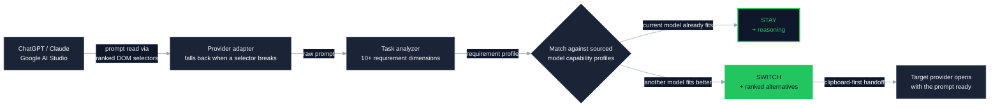
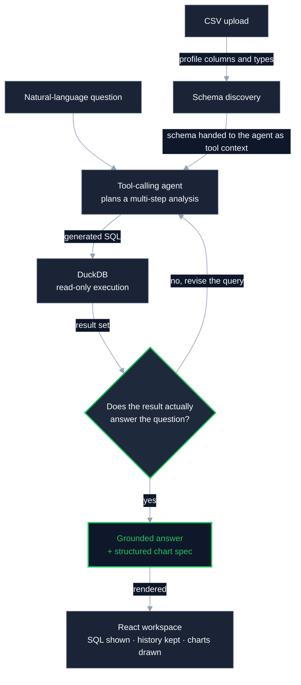
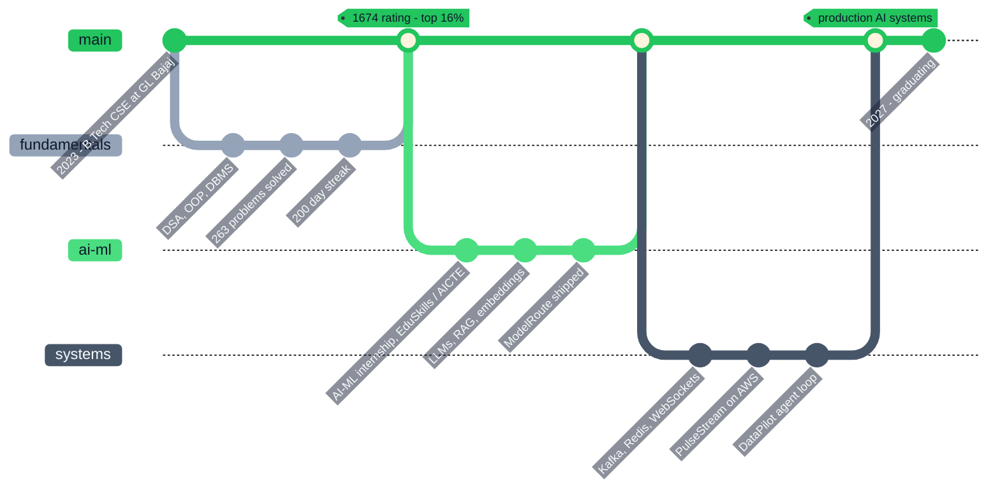

<!--
═══════════════════════════════════════════════════════════════════════════════
  AMAN SINGH YADAV — GitHub Profile README
  Repo: github.com/amansinghyadav4/amansinghyadav4  (file must be README.md)

  DESIGN SYSTEM — "Developer Tool / IDE" dark palette
    bg #0F172A   card #1B2336   primary #1E293B   border #475569
    accent #22C55E   text #F8FAFC   muted #94A3B8
    type  JetBrains Mono (headings/animation) + IBM Plex Sans

  WHY EVERY VISUAL IS A DARK CARD:
    #22C55E green on GitHub's LIGHT theme = 2.28:1 contrast -> FAILS WCAG.
    So no asset is drawn on the page background. Each SVG/badge carries its
    own #0F172A ground: 17.85:1 against white, 7.83:1 AAA for green inside.
    Result: pixel-identical in GitHub light AND dark mode. Do not remove the
    `labelColor=0F172A` / `background=0F172A` / `theme=dark` params.

  SERVICE STATUS (checked 2026-09-05) — all embeds below return HTTP 200.
    DEAD, deliberately excluded:
      github-readme-stats.vercel.app      -> 503
      github-profile-trophy.vercel.app    -> 402 (Vercel quota)
      github-readme-activity-graph...     -> 402  <-- your OLD readme used this
    If they recover, see the commented blocks in sections 07 and 05.
═══════════════════════════════════════════════════════════════════════════════
-->

<div align="center">

<a href="https://aman-singh-yadav-portfolio.vercel.app/">

</a>


<br />

<a href="https://aman-singh-yadav-portfolio.vercel.app/"></a>
<a href="https://www.linkedin.com/in/amansinghyadav9569/"></a>
<a href="mailto:aman.dev9569@gmail.com"></a>
<a href="https://www.instagram.com/aman.singh.yadav_"></a>
<br />


</div>

## &nbsp; WHO I AM

```bash
$ whoami
aman-singh-yadav

$ cat ~/.profile
ROLE   = "AI/ML Engineer · Backend & Distributed Systems"
STUDY  = "B.Tech CSE (AI & ML) · GL Bajaj Institute · 2023–2027 · 7.7 CGPA"
BASE   = "Greater Noida, Uttar Pradesh, India"
STACK  = ["Python", "FastAPI", "Kafka", "PostgreSQL", "Redis", "AWS", "Docker"]

$ ./what-i-actually-build --verbose
> I work where AI stops being a feature and becomes part of the system:
>   · retrieval that stays grounded instead of confidently guessing
>   · agents whose SQL is executed read-only and validated before you see it
>   · event pipelines that stay correct when the same message arrives twice
>   · services that report their own latency, lag and failures
```

<div align="center">

<table>
<tr>
<td width="50%" valign="top">
<br />
<b>INTELLIGENT SYSTEMS</b><br />
<sub>LLM orchestration, RAG over pgvector, embeddings and semantic search, tool-calling agents, prompt engineering, scikit-learn</sub>
</td>
<td width="50%" valign="top">
<br />
<b>REAL-TIME &amp; DISTRIBUTED</b><br />
<sub>Kafka topics and consumer groups, idempotent workers, WebSocket fan-out, throughput / consumer-lag / latency monitoring</sub>
</td>
</tr>
<tr>
<td width="50%" valign="top">
<br />
<b>BACKEND ENGINEERING</b><br />
<sub>FastAPI and Express services, REST design, multi-tenant isolation, API-key auth, OAuth 2.0, schema and query design</sub>
</td>
<td width="50%" valign="top">
<br />
<b>SHIP &amp; OPERATE</b><br />
<sub>Dockerised services on AWS, Linux, CI/CD pipelines, automated test suites, debugging production behaviour</sub>
</td>
</tr>
</table>


</div>

## &nbsp; TECH STACK

<div align="center">

<table>
<tr><td align="right" valign="middle"><sub><b>LANGUAGES</b></sub></td>
<td></td></tr>

<tr><td align="right" valign="middle"><sub><b>AI&nbsp;/&nbsp;ML</b></sub></td>
<td>

</td></tr>

<tr><td align="right" valign="middle"><sub><b>BACKEND</b></sub></td>
<td></td></tr>

<tr><td align="right" valign="middle"><sub><b>DATA</b></sub></td>
<td>

</td></tr>

<tr><td align="right" valign="middle"><sub><b>STREAMING</b></sub></td>
<td>
</td></tr>

<tr><td align="right" valign="middle"><sub><b>CLOUD&nbsp;&amp;&nbsp;OPS</b></sub></td>
<td></td></tr>

<tr><td align="right" valign="middle"><sub><b>FRONTEND</b></sub></td>
<td></td></tr>
</table>

<sub><b>Also:</b>


</sub>


</div>

## &nbsp; FEATURED SYSTEMS

> [!NOTE]
> Every diagram below is a live Mermaid render — it shows how the system actually
> moves data, not a box labelled with its own name.

<br />

### &nbsp; ModelRoute &nbsp;·&nbsp; <sub>the right model for the prompt you just wrote</sub>

<a href="https://github.com/amansinghyadav4/ModelRoute"></a>


A privacy-first Chrome extension that reads the prompt you are about to send, scores what the
task actually needs, and tells you whether to **stay** on the current model or **switch** — with
the reasoning attached, so the recommendation is auditable instead of magic.



<details>
<summary><b>What makes it hold up in production</b></summary>

- **Explainable routing, not a vibe check** — task requirements are matched against sourced model capability profiles, so every `STAY` / `SWITCH` verdict ships with reasoning and alternatives.
- **Adapters that survive UI churn** — ranked DOM selectors with fallback chains, model detection, and service-worker recovery, because provider pages change without warning.
- **Cross-provider handoff** — clipboard-first transfer so a switch takes one action, with fallback flows when a provider blocks programmatic paste.
- **Backed by tests** — **300+ automated tests** covering analysis, matching, and each provider adapter.
- **Privacy by construction** — prompt analysis stays local to the browser; nothing is shipped off to be logged.


</details>

<br />

### &nbsp; PulseStream &nbsp;·&nbsp; <sub>multi-tenant events, visible the moment they land</sub>

<a href="https://github.com/amansinghyadav4/PulseStream"></a>


A real-time event processing platform deployed on AWS where each tenant is isolated end to end,
a replayed event is a no-op, and the dashboard shows you throughput, consumer lag, failures and
latency while they are still happening — not in tomorrow's report.

```mermaid
%%{init: {"theme":"base","themeVariables":{"primaryColor":"#1B2336","primaryTextColor":"#F8FAFC","primaryBorderColor":"#475569","secondaryColor":"#1E293B","tertiaryColor":"#0F172A","lineColor":"#94A3B8","textColor":"#F8FAFC","edgeLabelBackground":"#0F172A","fontSize":"13px"}}}%%
flowchart LR
    P["Tenant producers"] -->|"events + API key"| ING["FastAPI ingest<br/>resolves tenant, rejects unknown keys"]
    ING -->|"published per tenant"| K[("Kafka topic")]
    K -->|"consumer group"| WK["Idempotent workers<br/>a replayed event changes nothing"]
    WK -->|"durable rows"| PG[("PostgreSQL")]
    WK -->|"hot counters"| RD[("Redis")]
    RD -->|"rolled up in 1.05 ms avg"| AW["Analytics worker"]
    AW -->|"pushed over WebSocket"| DASH["React dashboard<br/>throughput · lag · failures · latency"]
    style DASH fill:#0F172A,stroke:#22C55E,stroke-width:2px,color:#22C55E
    style K fill:#1E293B,stroke:#22C55E,stroke-width:2px,color:#F8FAFC
```



<details>
<summary><b>What makes it hold up in production</b></summary>

- **Tenant isolation is enforced, not assumed** — API-key authentication resolves the tenant at ingest, and every downstream write and read is scoped to it.
- **Idempotent Kafka workers** — duplicate delivery is expected, so a re-consumed event produces no second effect; recovery across multiple producers was verified end to end.
- **The pipeline watches itself** — throughput, consumer lag, failure counts and processing latency are first-class metrics, not afterthoughts.
- **Measured, not estimated** — **2,500+ events** driven through the full pipeline at **1.05 ms** average analytics-worker latency.
- **Reproducible deploys** — Dockerised services running on AWS with live analytics streamed to React over WebSockets.


</details>

<br />

### &nbsp; DataPilot &nbsp;·&nbsp; <sub>ask a CSV a question, get a checked answer</sub>

<a href="https://github.com/amansinghyadav4/DataPilot"></a>


A full-stack AI data analyst that turns a plain-English question into SQL over your uploaded CSV.
The part that matters is the loop: generated SQL runs **read-only**, the result is validated against
the question, and a failed check sends the agent back to revise rather than forward to answer.



<details>
<summary><b>What makes it hold up in production</b></summary>

- **Validation before answering** — the agent orchestrates schema discovery, SQL generation, execution and result checking; analysis that fails validation never reaches the user as a claim.
- **Read-only by construction** — generated SQL executes against DuckDB with no write path, so a bad generation cannot damage the dataset.
- **Transparent, not a black box** — the workspace shows the SQL it ran, keeps analysis history, and profiles the dataset before you ask anything.
- **Charts from structure, not guesses** — visualisations are driven by structured chart specifications the agent emits, so the picture matches the query that produced it.


</details>

<div align="center">

</div>

## &nbsp; PROOF OF WORK

<div align="center">
<table>
<tr>
<td align="center" width="25%">
<br />
<sub><b>LeetCode contest rating</b><br />top <b>16.12%</b> globally · 9 contests</sub>
</td>
<td align="center" width="25%">
<br />
<sub><b>DSA problems solved</b><br />plus the <b>200 Days</b> badge</sub>
</td>
<td align="center" width="25%">
<br />
<sub><b>automated tests</b><br />written for ModelRoute</sub>
</td>
<td align="center" width="25%">
<br />
<sub><b>avg worker latency</b><br />over 2,500+ events</sub>
</td>
</tr>
</table>


<!-- LIVE LEETCODE CARD — add your LeetCode username where marked and uncomment:

-->


</div>

## &nbsp; GITHUB ACTIVITY

<div align="center">


<br /><br />


<br /><br />

<b><sub>CONTRIBUTION GRID</sub></b><br />


<!-- github-readme-stats (503) and github-profile-trophy (402) were BOTH DOWN on
     2026-09-05, which is why they are not embedded. Re-test before enabling:


-->

</div>

<div align="center">

<b><sub>CONTRIBUTION SNAKE</sub></b><br />

<!--
  The snake is generated by a GitHub Action, not a live service — it renders only
  after the workflow has run once. The workflow is included next to this README as
  `snake.yml`: copy it to `.github/workflows/snake.yml` in the amansinghyadav4/amansinghyadav4
  repo, push, then run it once from the Actions tab. It commits the SVGs to a branch
  called `output`, which is what the two URLs below point at.
-->
<picture>
  <source media="(prefers-color-scheme: dark)" srcset="https://raw.githubusercontent.com/amansinghyadav4/amansinghyadav4/output/github-contribution-grid-snake-dark.svg" />
  <source media="(prefers-color-scheme: light)" srcset="https://raw.githubusercontent.com/amansinghyadav4/amansinghyadav4/output/github-contribution-grid-snake.svg" />
  
</picture>


</div>

## &nbsp; THE PATH SO FAR



<div align="center">

</div>

## &nbsp; CREDENTIALS

<table>
<tr>
<td width="55%" valign="top">
<b>EDUCATION</b><br /><br />
<b>GL Bajaj Institute of Technology &amp; Management</b><br />
<sub>B.Tech, Computer Science &amp; Engineering (AI &amp; ML)</sub><br />
<sub>2023 – 2027 &nbsp;·&nbsp; Greater Noida &nbsp;·&nbsp; <b>CGPA 7.7 / 10</b></sub>
</td>
<td width="45%" valign="top">
<b>CERTIFICATIONS</b><br /><br />
<a href="https://drive.google.com/file/d/1ngmgoW5seeT9NDH7_udMvVVVrvnoR3HP/view?usp=sharing"></a><br />
<a href="https://drive.google.com/file/d/1ZZ6WqIOIph5qAVpGRFCUTFV7p_OYGjch/view?usp=sharing"></a>
</td>
</tr>
</table>

## &nbsp; WHAT I AM DIGGING INTO NEXT

```yaml
currently_learning:
  - "designing LLM systems that stay cheap and correct at scale"
  - "retrieval quality: chunking, reranking, and knowing when not to answer"
  - "distributed systems failure modes — partitions, replay, backpressure"
  - "cloud-native operations: observability that catches problems first"

open_to:
  - "AI/ML engineering internships and roles"
  - "backend and distributed systems work"
  - "anything where the hard part is the system, not the demo"
```

<div align="center">


## &nbsp; LET'S TALK


<br />

<a href="mailto:aman.dev9569@gmail.com"></a>
<a href="https://www.linkedin.com/in/amansinghyadav9569/"></a>
<a href="https://aman-singh-yadav-portfolio.vercel.app/"></a>
<a href="https://github.com/amansinghyadav4"></a>

<br /><br />


</div>
